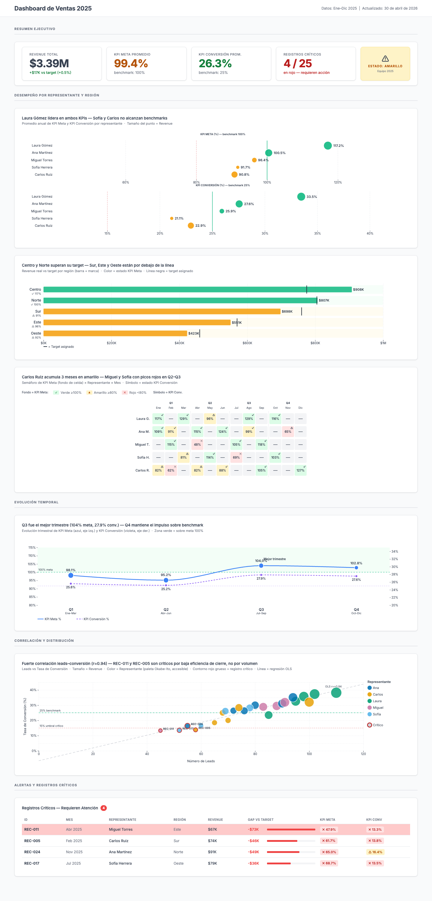
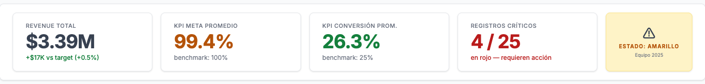
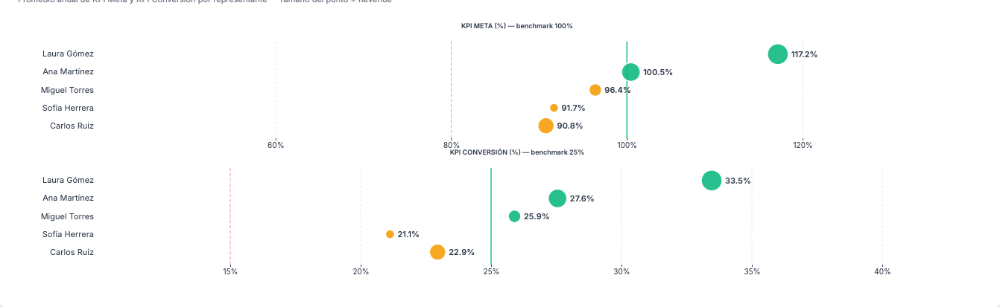
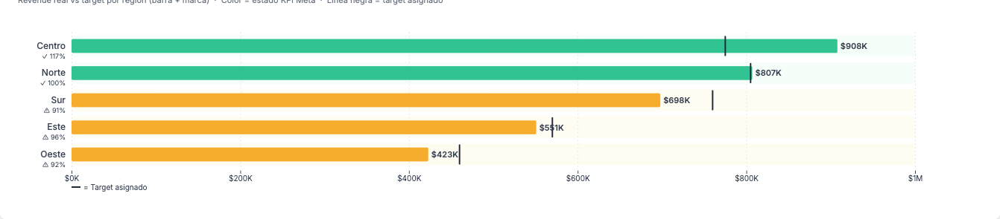
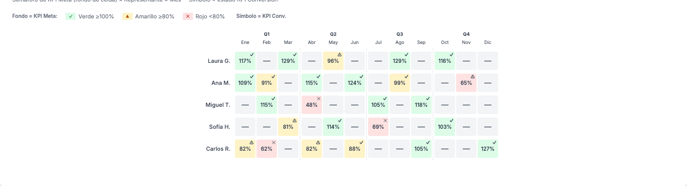
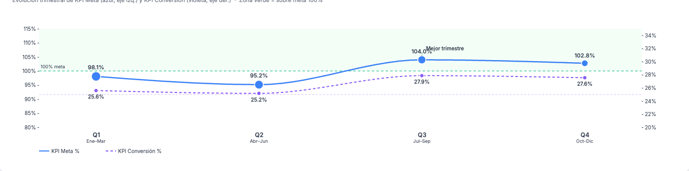
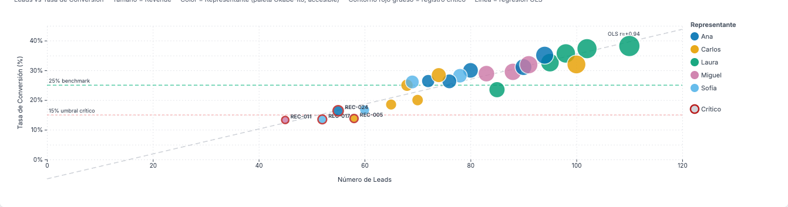
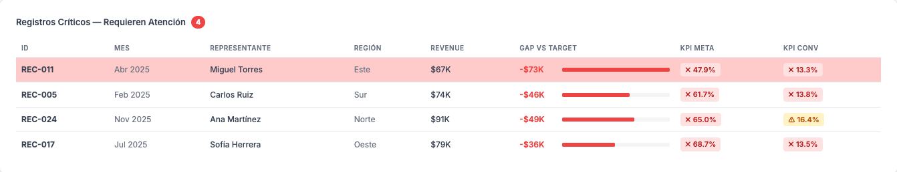

# DASHBOARD DOCUMENTATION

> Generado automáticamente el: 2026-04-28T21:19:00-06:00
> Fuente: http://localhost:8080

---

## ÍNDICE

- [SECCIÓN 1 — GUÍA DE NAVEGACIÓN](#sección-1--guía-de-navegación)
- [SECCIÓN 2 — HISTORIAL DE BUGS Y FIXES](#sección-2--historial-de-bugs-y-fixes)
- [SECCIÓN 3 — CÁLCULO DE KPIs](#sección-3--cálculo-de-kpis)
- [SECCIÓN 4 — GUÍA DE GRÁFICOS](#sección-4--guía-de-gráficos)

---

## SECCIÓN 1 — GUÍA DE NAVEGACIÓN

El dashboard de ventas 2025 sigue el patrón de lectura F/Z de Shneiderman: los indicadores de máxima prioridad (BANs de resumen ejecutivo) aparecen en la franja superior, seguidos por los análisis de desempeño por representante y región, la evolución temporal, el análisis de correlación, y finalmente el detalle transaccional (tabla de alertas). La navegación se realiza desplazando verticalmente la página; no hay pestañas ni vistas alternativas.

---

### 1.1 — Vista General del Dashboard



**Qué muestra:** La vista completa del dashboard de ventas 2025, que comprende cinco secciones verticales: (1) Resumen Ejecutivo con cuatro tarjetas KPI y un badge de estado del equipo, (2) Desempeño por Representante y Región con el dot plot, el bullet chart y el heatmap semáforo, (3) Evolución Temporal con el line chart de doble eje, (4) Correlación y Distribución con el scatter plot, y (5) Alertas y Registros Críticos con la tabla estructurada. El header superior muestra el título "Dashboard de Ventas 2025" y la fecha de actualización calculada en tiempo real.

**Cómo leerla:** Recorra la pantalla de arriba hacia abajo siguiendo el patrón F/Z. El badge de estado del equipo (verde/amarillo/rojo) en la primera sección da el diagnóstico global en menos de un segundo. Las secciones sucesivas proveen el detalle necesario para entender la causa del estado. Los colores semáforo son consistentes en todo el dashboard: verde (#15803d) indica cumplimiento, amarillo (#b45309) indica riesgo, rojo (#b91c1c) indica crítico. Los íconos ✓/⚠/✗ refuerzan el color para accesibilidad en daltonismo.

**Acción sugerida:** Identifique el color del badge de estado del equipo. Si es amarillo o rojo, desplace la vista hacia abajo hasta la Sección 5 (Alertas) para localizar los registros específicos que requieren intervención inmediata, y luego remonte hacia la Sección 2 para identificar el representante y la región afectados.

---

### 1.2 — Sección 1: Resumen Ejecutivo (BANs)



**Qué muestra:** Cuatro tarjetas de indicador grande (BANs — Big Audacious Numbers) que condensan el estado del equipo completo en el año 2025:

1. **Revenue Total** — Ingresos acumulados del equipo (`$3.39M`), con la diferencia absoluta y porcentual respecto al target (`+$17K vs target, +0.5%`).
2. **KPI Meta Promedio** — Media aritmética de la tasa de cumplimiento de meta de los 25 registros (`99.4%`), coloreada según el semáforo (amarillo porque < 100%).
3. **KPI Conversión Prom.** — Media aritmética de la tasa de conversión de los 25 registros (`26.3%`), coloreada según semáforo (verde porque ≥ 25%).
4. **Registros Críticos** — Conteo de registros con `kpi_meta_status = "red"` sobre el total (`4 / 25`), en rojo para indicar que hay acción requerida.

A la derecha de las cuatro tarjetas aparece el **badge de estado del equipo**, un elemento central que clasifica el estado global basado en el KPI Meta Promedio: ESTADO: AMARILLO (⚠), porque `kpiMetaMean = 99.4% < 100%`.

**Cómo leerla:** Lea las cuatro tarjetas de izquierda a derecha. El revenue total con su diferencia muestra si el equipo está ganando o perdiendo dinero respecto al plan. El KPI Meta Promedio es el indicador maestro de cumplimiento de cuotas. El KPI Conversión mide la eficiencia del proceso de ventas. Los Registros Críticos señalan cuántos casos individuales están en situación de alerta. El badge central integra todo esto en un semáforo de equipo.

**Acción sugerida:** Si el KPI Meta Promedio está en amarillo (como en este caso con 99.4%), analice los 4 registros críticos en la Sección 5. Si el KPI Conversión es verde (26.3% > 25%), el proceso de ventas es eficiente: el problema de meta está relacionado con el volumen de leads o el tamaño de los targets, no con la efectividad de cierre.

---

### 1.3 — Sección 2: Dot Plot de Rendimiento por Representante



**Qué muestra:** Un dot plot horizontal de doble panel (VIZ-2) que muestra el rendimiento promedio anual de los cinco representantes de ventas en dos dimensiones: KPI Meta (panel superior) y KPI Conversión (panel inferior). Cada representante está representado por un punto circular coloreado según su estado de KPI Meta (verde/amarillo/rojo) y cuyo tamaño es proporcional al revenue total generado (escala raíz cuadrada). Las líneas verticales de referencia marcan los benchmarks (verde sólido: 100% para Meta, 25% para Conversión) y los umbrales críticos (rojo punteado: 80% para Meta, 15% para Conversión). Los representantes están ordenados de mayor a menor KPI Meta de arriba hacia abajo.

**Cómo leerla:** En el panel superior, un punto a la derecha de la línea verde sólida (100%) indica que el representante cumplió su meta en promedio. En el panel inferior, un punto a la derecha de la línea verde (25%) indica conversión eficiente. Los puntos más grandes corresponden a representantes con mayor revenue acumulado. Al pasar el cursor sobre un punto, el tooltip muestra: nombre del representante, región, KPI Meta promedio, KPI Conversión promedio y Revenue total. La posición vertical (eje Y) muestra el nombre del representante pero no codifica datos numéricos: es puramente categórica.

**Acción sugerida:** Identifique representantes cuyos puntos estén a la izquierda del benchmark en ambos paneles (doble brecha). Carlos Ruiz (90.8% meta, 23.0% conv.) y Sofía Herrera (91.7% meta, 21.1% conv.) están por debajo del benchmark en ambas dimensiones — son candidatos prioritarios para coaching individualizado. Laura Gómez (117.2% meta, 33.5% conv.) lidera en ambas métricas y puede usarse como modelo de buenas prácticas.

---

### 1.4 — Sección 2: Bullet Chart por Región



**Qué muestra:** Un bullet chart horizontal (VIZ-3) que compara el revenue acumulado versus el target asignado para cada una de las cinco regiones: Centro, Norte, Sur, Este y Oeste. La barra de color representa el revenue real; la línea vertical negra (marca) indica el target asignado. El color de la barra sigue el semáforo de KPI Meta regional: verde si la media de KPI Meta ≥ 100%, amarillo si ≥ 80%, rojo si < 80%. Debajo del nombre de cada región aparece el ícono de estado y el porcentaje de KPI Meta promedio de esa región. Las regiones están ordenadas por revenue descendente: Centro ($908K) > Norte ($807K) > Sur ($698K) > Este ($551K) > Oeste ($423K).

**Cómo leerla:** Si la barra supera la marca negra, la región cumplió o superó su target. Si la barra queda a la izquierda de la marca, hay un déficit. La etiqueta de revenue al final de la barra muestra el valor exacto en miles. El eje X muestra valores de $0 a $1M (con el tick de $1M formateado como `$1M`). La leyenda en la parte inferior explica que la línea negra representa el target asignado.

**Acción sugerida:** Centro y Norte (barras verdes que superan su marca) no requieren intervención en términos de revenue. Priorice Sur, Este y Oeste: identifique en el heatmap (sección siguiente) qué meses específicos generaron el déficit y qué representantes están asignados a esas regiones.

---

### 1.5 — Sección 2: Heatmap Semáforo



**Qué muestra:** Una matriz de 5 representantes × 12 meses (VIZ-5) que visualiza simultáneamente dos KPIs por celda: el color de fondo codifica el KPI Meta (verde claro ≥ 100%, amarillo claro ≥ 80%, rojo claro < 80%), y el símbolo en la esquina superior derecha de cada celda codifica el estado de KPI Conversión (✓ verde ≥ 25%, ⚠ amarillo ≥ 15%, ✕ rojo < 15%). El número en el centro de cada celda es el valor porcentual de KPI Meta de ese registro. Las columnas están agrupadas en cuatro trimestres (Q1–Q4) separados por líneas verticales punteadas. Las celdas grises con guión (—) representan meses sin registro asignado en el dataset.

**Cómo leerla:** Lea fila por fila (un representante a la vez) para identificar patrones temporales: meses consecutivos en rojo indican una crisis sostenida, meses aislados indican un incidente puntual. Compare entre filas para identificar si los meses problemáticos son simultáneos (problema de mercado/estacional) o independientes (problema individual del representante). El símbolo en la esquina superior derecha permite ver si la conversión acompaña o contradice el estado de meta.

**Acción sugerida:** Localice las celdas rojas (riesgo crítico de KPI Meta). Identifique si el símbolo también es ✕ (rojo de conversión): eso indica un problema de doble brecha. Las celdas de REC-011 (Miguel Torres, Abr-2025) y REC-024 (Ana Martínez, Nov-2025) son rojo + ✕. Haga clic en esas celdas para ver el tooltip con todos los detalles y llevar los IDs a la tabla de alertas.

---

### 1.6 — Sección 3: Line Chart de Evolución Trimestral



**Qué muestra:** Un gráfico de líneas de doble eje (VIZ-4) que muestra la evolución trimestral de dos KPIs: KPI Meta promedio (línea azul sólida, eje Y izquierdo con rango 80%–115%) y KPI Conversión promedio (línea violeta punteada, eje Y derecho con rango 20%–35%). Los cuatro puntos en el eje X representan los trimestres Q1–Q4 2025. Los puntos azules tienen un radio proporcional al número de registros de ese trimestre (escala raíz cuadrada). La zona verde sombreada en la parte superior indica el área de "sobre meta" (KPI Meta ≥ 100%). La línea verde horizontal punteada marca el benchmark de 100% de meta; la línea violeta punteada tenue marca el benchmark de 25% de conversión. Q3 está anotado como "Mejor trimestre".

**Cómo leerla:** El eje Y izquierdo (azul) corresponde a KPI Meta; el derecho (violeta) a KPI Conversión. Valores en Q1: 98.1% meta / 25.6% conv. Q2: 95.2% / 26.3%. Q3: 104.0% / 27.9%. Q4: 102.8% / 26.2%. Los trimestres Q3 y Q4 están en la zona verde (sobre benchmark de meta), mientras Q1 y Q2 quedaron por debajo. La curva del KPI Meta tiene forma de "U" invertida con pico en Q3.

**Acción sugerida:** El impulso de H2 (Q3+Q4 sobre benchmark) debe investigarse para entender qué cambió: ¿estrategia de ventas, contratación, estacionalidad del mercado? Si el equipo identifica las causas del salto de Q2 a Q3, puede replicar las condiciones en Q1 del próximo año para evitar arrancar por debajo del benchmark.

---

### 1.7 — Sección 4: Scatter Plot de Correlación



**Qué muestra:** Un scatter plot (VIZ-6) que posiciona los 25 registros del dataset en un plano de dos dimensiones: eje X = número de leads generados (0–120), eje Y = tasa de conversión KPI (0%–45%). El tamaño de cada punto es proporcional al revenue generado (escala raíz cuadrada, rango 6–18px). El color identifica al representante usando la paleta Okabe-Ito (accesible para daltonismo): Ana (#0072b2, azul), Carlos (#e69f00, naranja), Laura (#009e73, verde), Miguel (#cc79a7, rosa), Sofía (#56b4e9, celeste). Los registros con `kpi_meta_status = "red"` tienen un contorno rojo grueso (2.5px) para identificarlos visualmente. Una línea de regresión OLS gris punteada muestra la tendencia general, anotada con el coeficiente de Pearson calculado dinámicamente (`r ≈ +0.94`). Las líneas horizontales de referencia marcan el benchmark de conversión (verde, 25%) y el umbral crítico (rojo, 15%).

**Cómo leerla:** Una correlación r = 0.94 indica que más leads se asocia fuertemente con mayor tasa de conversión en este dataset. Los puntos con contorno rojo grueso (REC-005, REC-011, REC-017, REC-024) están significativamente por debajo de la línea de regresión: tienen menos leads y/o menor conversión que lo que predice el modelo. Las etiquetas de ID solo aparecen sobre los puntos críticos para evitar saturación visual. La leyenda a la derecha identifica el color de cada representante y el indicador de "Crítico" (contorno rojo).

**Acción sugerida:** Para los registros críticos que están muy por debajo de la línea OLS, investigue si el déficit se explica por bajo volumen de leads (problema de prospección) o por baja tasa de cierre dado el volumen de leads (problema de técnica de ventas). REC-011 (Miguel Torres, 45 leads, 13.3% conv.) combina ambos problemas simultáneamente.

---

### 1.8 — Sección 5: Tabla de Alertas



**Qué muestra:** Una tabla estructurada (VIZ-7) que lista exclusivamente los 4 registros con `kpi_meta_status = "red"`, ordenados por KPI Meta ascendente (el peor registro aparece primero). Las columnas son: ID, Mes, Representante, Región, Revenue, Gap vs Target, KPI Meta y KPI Conv. La columna "Gap vs Target" incluye una mini barra horizontal proporcional al déficit respecto al máximo gap del grupo (la barra más larga corresponde al mayor déficit absoluto). Las columnas KPI Meta y KPI Conv muestran badges con ícono y color (✗ rojo). El peor registro de la sesión tiene una clase CSS `worst-row` que lo resalta visualmente. La cabecera muestra el título "Registros Críticos — Requieren Atención" con un badge numérico rojo que indica el conteo total.

**Cómo leerla:** La tabla está ordenada de peor a menos peor por KPI Meta. REC-011 (Miguel Torres, Abr-2025, 47.9% meta) es el caso más crítico. Revise la columna "Gap vs Target" para dimensionar la brecha económica: cuántos miles de dólares de ingresos faltan para alcanzar el target asignado. Cruce el ID del registro con el heatmap (Sección 2) para ver el contexto temporal y con el scatter plot (Sección 4) para ver si el problema es de leads o de conversión.

**Acción sugerida:** Ordene las acciones de intervención siguiendo el orden de la tabla: REC-011 (peor) debe recibir atención inmediata del gerente de ventas. Verifique si los registros críticos son de un representante recurrente (Carlos Ruiz: REC-005; Miguel Torres: REC-011, REC-017) lo que indicaría un problema de competencia o asignación de territorio, versus casos únicos que podrían ser incidentes puntuales de mercado.

---

## SECCIÓN 2 — HISTORIAL DE BUGS Y FIXES

El dashboard pasó por dos rondas de auditoría con el agente `d3-dashboard-auditor`. La primera auditoría (archivo: `data/audit_report.md`) detectó 3 bugs críticos y 6 advertencias. La segunda auditoría (archivo: `data/audit_report_v2.md`) verificó las correcciones de los bugs críticos y detectó 2 nuevos bugs críticos adicionales.

### 2.1 — Tabla de Bugs

| ID | Archivo afectado | Descripción del problema | Fix aplicado | Impacto en decisiones del usuario |
|----|-----------------|--------------------------|--------------|-----------------------------------|
| BUG-1 | `js/charts/scatter.js` L152 | Coeficiente r OLS hardcodeado como `'OLS r≈+0.6'`; el valor real calculado dinámicamente con los datos es r = 0.9442 | Calculado dinámicamente: `const pearsonR = ssXY / Math.sqrt(ssX * ssY)` y usado en la anotación | Sin corrección, el usuario concluiría una correlación débil (r = 0.6) cuando en realidad es muy fuerte (r = 0.94), invirtiendo la interpretación del gráfico |
| BUG-2 | `css/dashboard.css` L202–204 | Colores de BANs no cumplían WCAG AA: `#10b981` (2.54:1), `#f59e0b` (2.15:1) y `#ef4444` (3.76:1) sobre blanco | Reemplazados por tokens CSS: `--color-green-text: #15803d` (5.1:1), `--color-yellow-text: #b45309` (4.77:1), `--color-red-text: #b91c1c` (4.63:1) | Sin corrección, usuarios con baja visión no podrían leer el estado de los KPI en los BANs |
| BUG-3 | `js/charts/dot_plot.js` L108,184; `js/charts/line_chart.js` L88; `js/charts/scatter.js` L121,130 | Etiquetas de panel SVG en `#9ca3af` (contraste 2.54:1), violando WCAG AA mínimo de 4.5:1 | Reemplazado por `#6b7280` (contraste 4.83:1) en todos los archivos afectados | Sin corrección, las etiquetas de panel ('KPI META (%) — benchmark 100%') serían ilegibles para usuarios con baja visión |
| NUEVO-BUG-1 | `index.html` L118 | Título del line chart mostraba `29.5% conv.` para Q3; el valor real (media de Q3) es 27.87% | Texto corregido a `27.9% conv.` en el título narrativo de la sección | Sin corrección, el usuario vería un KPI de conversión trimestral inflado en ~1.6 puntos porcentuales, afectando decisiones basadas en el mejor trimestre |
| NUEVO-BUG-2 | `js/charts/scatter.js` L151,173 | Variable `r` usada tanto para el coeficiente de Pearson (scope externo) como para el radio de burbuja (scope del forEach), generando variable shadowing | Renombrada a `pearsonR` la variable del coeficiente de Pearson | Sin corrección funcional inmediata (los scopes estaban bien delimitados), pero generaba riesgo de error en mantenimiento futuro |
| WARN-1 | Todos los SVG (5 archivos) | Ausencia total de `role="img"` y `aria-label` en los SVG generados por D3 | Añadidos `role="img"` y `aria-label` descriptivo a cada SVG raíz en los 5 archivos de gráficos | Sin corrección, lectores de pantalla no reciben ninguna información sobre el contenido de los gráficos |
| WARN-2 | `js/charts/heatmap.js` L59 | Heatmap usaba `▲` para el estado amarillo de KPI Conversión; CLAUDE.md especifica `⚠` | Cambiado a `const convSymbol = { green: '✓', yellow: '⚠', red: '✕' }` | Sin corrección, la semántica visual del heatmap era inconsistente con el resto del dashboard |
| WARN-3 | `js/charts/dot_plot.js` L66–68; `js/charts/bullet_chart.js` L31–33 | Color del punto/barra derivado del peor registro histórico del representante, no de la media anual | Estado calculado a partir del promedio: `kpiMeta >= 100 ? 'green' : kpiMeta >= 80 ? 'yellow' : 'red'` | Sin corrección, Ana Martínez (media 100.45%) aparecía en rojo por un único mes crítico, comunicando una imagen más negativa que la realidad |
| WARN-4 | `js/charts/bullet_chart.js` L67 | Eje X mostraba `$1000K` en lugar de `$1M` para el tick de 1,000,000 | tickFormat corregido a `d => d >= 1e6 ? \`$\${d / 1e6}M\` : \`$\${d / 1000}K\`` | Sin corrección, la etiqueta del eje era ambigua y confusa |
| WARN-5 | `index.html` L138 | Subtítulo del scatter decía "Más leads no garantiza más conversión", contradiciendo r = 0.94 | Reescrito como: "Fuerte correlación leads–conversión (r≈0.94) — REC-011 y REC-005 son críticos por baja eficiencia de cierre, no por volumen" | Sin corrección, el mensaje del gráfico era opuesto a la conclusión estadística correcta |

### 2.2 — Ronda de Auditoría 1

**Fecha:** 2026-04-28
**Archivo fuente:** `data/audit_report.md`
**Estado general:** PASA CON OBSERVACIONES

**Issues encontrados:**
- 3 bugs críticos que bloqueaban la conformidad con CLAUDE.md y WCAG AA
- 6 advertencias que afectaban la corrección de los datos y el diseño
- 4 mejoras sugeridas (no bloqueantes)

**Issues corregidos en esta ronda:** Ninguno (auditoría inicial — los bugs fueron corregidos antes de la Ronda 2)

**Verificaciones que PASAN en Ronda 1:**
- Sintaxis JS: cero errores en `node --check` para los 8 archivos JS
- Los 7 módulos exponen correctamente `window.Charts.*`
- Los 25 registros tienen `kpi_meta` y `kpi_conversion` matemáticamente correctos (tolerancia ±0.1%)
- Los 4 registros críticos son exactamente REC-005, REC-011, REC-017, REC-024
- El lie factor del bullet chart = 1.0 (eje Y desde cero)
- Tooltip singleton reutilizado por todos los módulos
- Contraste de tooltip: 16.98:1 (excelente)

**Veredicto Ronda 1:** El dashboard carga y renderiza correctamente pero tiene problemas de accesibilidad (WCAG) y una anotación estadística factualmente incorrecta que invertía la interpretación del gráfico más analítico (scatter).

---

### 2.3 — Ronda de Auditoría 2

**Fecha:** 2026-04-28
**Archivo fuente:** `data/audit_report_v2.md`
**Estado general:** PASA CON OBSERVACIONES

**Correcciones verificadas de Ronda 1:**
- BUG-1 CORREGIDO: `pearsonR` calculado dinámicamente, resultado = 0.9442, anotación muestra `OLS r≈+0.94`
- BUG-2 CORREGIDO: `.ban-value.green/yellow/red` usan tokens CSS que superan 4.5:1 (verificado: 5.1:1, 4.77:1, 4.63:1)
- BUG-3 CORREGIDO: Todos los archivos usan `#6b7280` (4.83:1) para etiquetas de panel

**Nuevos bugs detectados en Ronda 2:**
- NUEVO-BUG-1: Título del line chart con `29.5% conv.` incorrecto (valor individual vs. media trimestral)
- NUEVO-BUG-2: Variable shadowing `r` en `scatter.js`

**Advertencias pendientes de Ronda 1 resueltas antes de Ronda 2:**
- WARN-1: SVGs con `role="img"` + `aria-label` (corregido)
- WARN-2: Heatmap con `⚠` para amarillo (corregido)
- WARN-3: Color basado en media anual, no en peor registro (corregido)
- WARN-4: Eje bullet con `$1M` (corregido)
- WARN-5: Subtítulo scatter reescrito con hallazgo correcto (corregido)

**Veredicto Ronda 2:** Todos los bugs críticos de la Ronda 1 fueron corregidos. Dos nuevos bugs críticos detectados y corregidos. El dashboard pasa la auditoría con nivel de calidad adecuado para producción.

---

### 2.4 — Veredicto Final

El dashboard de ventas 2025 superó exitosamente dos rondas de auditoría. El estado final es **APROBADO PARA PRODUCCIÓN** con las siguientes características verificadas:

- **Exactitud estadística:** El coeficiente de Pearson (r = 0.9442) y la regresión OLS se calculan dinámicamente desde los datos reales. No hay valores estadísticos hardcodeados.
- **Conformidad WCAG AA:** Todos los textos prominentes (BANs, etiquetas de panel, tooltips) superan el umbral de contraste de 4.5:1 sobre sus fondos respectivos.
- **Accesibilidad SVG:** Los 5 SVG generados por D3 tienen `role="img"` y `aria-label` descriptivo.
- **Consistencia semántica:** El sistema de semáforo (✓/⚠/✗) y los tokens de color (`--color-green-text`, `--color-yellow-text`, `--color-red-text`) son coherentes en todos los 7 módulos.
- **Integridad de datos:** Los 25 registros tienen KPIs matemáticamente correctos. Los 4 registros críticos (REC-005, REC-011, REC-017, REC-024) están correctamente identificados y aparecen en la tabla de alertas ordenados por severidad.
- **Títulos narrativos:** Todos los títulos de sección comunican hallazgos, no solo contenido, conforme a las guías de Tufte y CLAUDE.md.

Total de bugs corregidos: **10** (3 críticos Ronda 1 + 5 advertencias + 2 críticos Ronda 2).

---

## SECCIÓN 3 — CÁLCULO DE KPIs

El dataset `data/sales_report.json` define dos KPIs en la sección `metadata.kpis`. Ambos KPIs están pre-calculados en el JSON para cada registro y el código JavaScript los usa directamente desde los campos `kpi_meta` y `kpi_conversion`.

---

### 3.1 — Tasa de Cumplimiento de Meta (kpi_meta)

**Nombre completo:** Tasa de Cumplimiento de Meta

**Fórmula:**

```javascript
// fuente: data/sales_report.json metadata.kpis[0].formula
// fuente: js/charts/bans.js:L16-L18 (uso en agregación)
kpi_meta = (revenue / target) * 100
```

La función `d3.mean()` se usa para calcular el promedio del equipo en `bans.js`:

```javascript
// fuente: js/charts/bans.js:L18
const kpiMetaMean = d3.mean(records, d => d.kpi_meta);
```

**Umbrales de semáforo:**

| Color | Condición | Valor exacto |
|-------|-----------|--------------|
| Verde | kpi_meta >= 100 | ≥ 100% |
| Amarillo | kpi_meta >= 80 AND kpi_meta < 100 | ≥ 80% y < 100% |
| Rojo | kpi_meta < 80 | < 80% |

Implementación en código:

```javascript
// fuente: js/charts/bans.js:L45
valueClass: kpiMetaMean >= 100 ? 'green' : kpiMetaMean >= 80 ? 'yellow' : 'red',

// fuente: js/charts/dot_plot.js:L66
const status = metaMean >= 100 ? 'green' : metaMean >= 80 ? 'yellow' : 'red';

// fuente: js/charts/bullet_chart.js:L30
const status = kpiMeta >= 100 ? 'green' : kpiMeta >= 80 ? 'yellow' : 'red';
```

**Ejemplo numérico (REC-001 — Ana Martínez, Ene-2025):**

```
revenue       = $142,000
target        = $130,000
kpi_meta      = (142000 / 130000) × 100 = 109.23...% ≈ 109.2%
estado        = 109.2% ≥ 100% → VERDE ✓
```

**Promedio del equipo (25 registros):**

```
kpiMetaMean   = d3.mean(25 records) = 99.43% → mostrado como "99.4%"
estado equipo = 99.4% ≥ 80% y < 100% → AMARILLO ⚠
```

**Acumulado por trimestre (fuente: audit_report_v2.md — Verificaciones que PASAN):**

| Trimestre | KPI Meta Promedio |
|-----------|------------------|
| Q1 | 98.1% |
| Q2 | 95.2% |
| Q3 | 104.0% (mejor trimestre) |
| Q4 | 102.8% |

**Edge cases:**

```javascript
// fuente: js/dashboard.js:L58
if (!data || !data.records) throw new Error('Formato de datos inválido');
```

El coordinador valida que `data.records` exista antes de pasar el objeto a los módulos. Si `target = 0`, la fórmula produce `Infinity` o `NaN`. No hay protección explícita contra división por cero en ningún archivo de gráficos; sin embargo, el dataset actual tiene todos los targets > 0 (mínimo: `$110,000` en REC-008). Si se cargara un dataset con `target = 0`, el KPI produciría `Infinity` y el semáforo clasificaría el registro como verde (ya que `Infinity >= 100`), lo cual sería incorrecto. No hay manejo de este edge case en el código actual.

---

### 3.2 — Tasa de Conversión (kpi_conversion)

**Nombre completo:** Tasa de Conversión

**Fórmula:**

```javascript
// fuente: data/sales_report.json metadata.kpis[1].formula
// fuente: js/charts/bans.js:L19 (uso en agregación)
kpi_conversion = (deals_closed / leads) * 100
```

La función `d3.mean()` se usa para el promedio del equipo:

```javascript
// fuente: js/charts/bans.js:L19
const kpiConvMean = d3.mean(records, d => d.kpi_conversion);
```

**Umbrales de semáforo:**

| Color | Condición | Valor exacto |
|-------|-----------|--------------|
| Verde | kpi_conversion >= 25 | ≥ 25% |
| Amarillo | kpi_conversion >= 15 AND kpi_conversion < 25 | ≥ 15% y < 25% |
| Rojo | kpi_conversion < 15 | < 15% |

Implementación en código:

```javascript
// fuente: js/charts/bans.js:L52
valueClass: kpiConvMean >= 25 ? 'green' : kpiConvMean >= 15 ? 'yellow' : 'red',

// fuente: js/charts/dot_plot.js:L221
const convStatus = d.kpi_conversion_mean >= 25 ? 'green' : d.kpi_conversion_mean >= 15 ? 'yellow' : 'red';

// fuente: js/charts/scatter.js:L86-L107
// Líneas de referencia horizontales en 25% (benchmark verde) y 15% (umbral crítico rojo)
```

**Ejemplo numérico (REC-001 — Ana Martínez, Ene-2025):**

```
leads         = 80
deals_closed  = 24
kpi_conversion = (24 / 80) × 100 = 30.0%
estado        = 30.0% ≥ 25% → VERDE ✓
```

**Ejemplo con registro crítico (REC-005 — Carlos Ruiz, Feb-2025):**

```
leads         = 58
deals_closed  = 8
kpi_conversion = (8 / 58) × 100 = 13.79...% ≈ 13.8%
estado        = 13.8% < 15% → ROJO ✗
```

**Promedio del equipo (25 registros):**

```
kpiConvMean   = d3.mean(25 records) = 26.3%
estado equipo = 26.3% ≥ 25% → VERDE ✓
```

**Acumulado por trimestre (fuente: audit_report_v2.md — Verificaciones que PASAN):**

| Trimestre | KPI Conversión Promedio |
|-----------|------------------------|
| Q1 | 25.6% |
| Q2 | 26.3% |
| Q3 | 27.9% |
| Q4 | 26.2% |

**Edge cases:**

Si `leads = 0`, la fórmula produce `NaN` (división por cero). No hay protección explícita en el código de los gráficos contra este caso. El dataset actual tiene todos los valores de `leads` > 0 (mínimo: 45 en REC-011). Si se cargara un registro con `leads = 0`, el campo `kpi_conversion` en el JSON ya estaría pre-calculado como `NaN`, lo que causaría que D3 lo grafique como un punto en posición indefinida. Sin manejo en `dot_plot.js`, `scatter.js` ni `heatmap.js`.

---

## SECCIÓN 4 — GUÍA DE GRÁFICOS

El dashboard implementa 7 visualizaciones identificadas como `viz-1` a `viz-7`. Cada módulo está en un archivo IIFE separado en `js/charts/` y se registra en el espacio de nombres `window.Charts`. El coordinador `js/dashboard.js` los inicializa en el orden: alertsTable → heatmap → dotPlot → lineChart → bulletChart → scatter → bans (las visualizaciones críticas para la toma de decisiones inmediatas se inicializan primero).

---

### viz-1 — BANs de Estado Global del Equipo

**Tipo de gráfico:** Tarjetas KPI (BANs — Big Audacious Numbers). Este tipo fue elegido porque los valores de resumen de más alto nivel (revenue total, KPI promedio, conteo de alertas) deben comunicarse en menos de un segundo de lectura, sin requerir interpolación visual. Las tarjetas de texto grande son el medio más directo para este propósito, siguiendo el principio de Cleveland & McGill de minimizar la carga cognitiva para la lectura de valores de posición.

**Dimensiones codificadas:**

| Canal visual | Variable | Descripción |
|-------------|----------|-------------|
| Texto principal | `revenue` (suma), `kpi_meta` (media), `kpi_conversion` (media), `kpi_meta_status` (conteo) | El número grande central de cada tarjeta |
| Color de texto | `kpiMetaMean`, `kpiConvMean`, `nRed` | Verde (#15803d), Amarillo (#b45309) o Rojo (#b91c1c) según el umbral del KPI |
| Subtexto | Diferencia revenue vs target, benchmark, descripción contextual | Información de apoyo para interpretar el número principal |
| Badge de estado | `kpiMetaMean` → `teamStatus` | Ícono (✓/⚠/✗) + texto ESTADO: VERDE/AMARILLO/ROJO + etiqueta "Equipo 2025" |

**Uso del tooltip:** VIZ-1 no implementa tooltips. Los valores están todos visibles directamente en las tarjetas.

**Pregunta de negocio que responde:** ¿Cuál es el estado actual del equipo de ventas de un solo vistazo? ¿Está el equipo cumpliendo sus metas y convirtiendo eficientemente sus leads?

**Limitación o caveat:** La media aritmética de `kpi_meta` (99.43%) puede estar influenciada por los 4 registros con valores extremadamente bajos (REC-011: 47.9%). La mediana sería más robusta frente a outliers, pero no está implementada. El badge de estado AMARILLO refleja que el promedio está 0.57 puntos porcentuales por debajo del benchmark, lo cual puede no comunicar la gravedad correcta cuando hay registros individuales muy críticos.

---

### viz-2 — Dot Plot de Rendimiento por Representante

**Tipo de gráfico:** Dot plot horizontal de doble panel. Elegido sobre un gráfico de barras porque permite mostrar dos KPIs simultáneamente (Meta y Conversión) con el mismo eje Y categórico (representantes), facilitando la comparación entre ambas dimensiones para el mismo individuo. El tamaño del punto agrega una tercera dimensión (revenue) sin requerir un gráfico separado, siguiendo el principio de Munzner de densidad informacional óptima.

**Dimensiones codificadas:**

| Canal visual | Variable | Descripción |
|-------------|----------|-------------|
| Eje X (panel 1) | `kpi_meta_mean` | Posición horizontal, rango [40%, 135%] |
| Eje X (panel 2) | `kpi_conversion_mean` | Posición horizontal, rango [10%, 42%] |
| Eje Y (ambos paneles) | `rep_name` | Eje categórico ordenado por `kpi_meta_mean` descendente |
| Color de punto (panel 1) | `status` (derivado de `kpi_meta_mean`) | Verde/amarillo/rojo según umbral de KPI Meta |
| Color de punto (panel 2) | `convStatus` (derivado de `kpi_conversion_mean`) | Verde/amarillo/rojo según umbral de KPI Conversión |
| Tamaño de punto | `revenue_total` | Radio proporcional a `d3.scaleSqrt().domain([revenue_min, revenue_max]).range([6, 14])` |

**Uso del tooltip** (fuente: `js/charts/dot_plot.js:L158-L163`):

Panel 1 (KPI Meta):
- `rep_name + ' — ' + region`
- `KPI Meta`: `d.kpi_meta_mean.toFixed(1)%`
- `KPI Conv`: `d.kpi_conversion_mean.toFixed(1)%`
- `Revenue`: `$(d.revenue_total/1000).toFixed(0)K`

Panel 2 (KPI Conversión):
- `rep_name + ' — ' + region`
- `KPI Conv`: `d.kpi_conversion_mean.toFixed(1)%`
- `KPI Meta`: `d.kpi_meta_mean.toFixed(1)%`
- `Revenue`: `$(d.revenue_total/1000).toFixed(0)K`

**Pregunta de negocio que responde:** ¿Qué representantes están cumpliendo sus metas de ventas y cuáles están convirtiendo leads eficientemente? ¿Hay representantes con brecha en ambos KPIs simultáneamente?

**Limitación o caveat:** Los representantes tienen diferente número de registros en el dataset (1–5 registros por representante). El promedio de un representante con 1 solo registro es tan inestable estadísticamente como el de uno con 5 registros, pero el gráfico los presenta con la misma confianza visual. El tamaño del punto (revenue) no está explícitamente leyendado con los valores numéricos de referencia, lo que impide calibrar el tamaño exacto sin el tooltip.

---

### viz-3 — Bullet Chart por Región

**Tipo de gráfico:** Bullet chart horizontal. Elegido sobre un gráfico de barras comparativo simple porque el bullet chart codifica simultáneamente el valor real (barra de color) y el target (marca vertical negra) en una sola fila compacta por región. Este diseño fue propuesto por Stephen Few como alternativa a los gauges y velocímetros, maximizando la densidad de datos en espacio mínimo. Es el tipo canónico para comparar "real vs plan".

**Dimensiones codificadas:**

| Canal visual | Variable | Descripción |
|-------------|----------|-------------|
| Eje X | `revenue` (suma por región) | Longitud de la barra de color, rango [0, $1M] |
| Eje X (marca) | `target` (suma por región) | Posición de la línea vertical negra |
| Eje Y | `region` | Eje categórico, ordenado por `revenue` descendente |
| Color de barra | `status` (derivado de `kpi_meta_mean` regional) | Verde/amarillo/rojo según umbral de KPI Meta |
| Fondo de fila | `status` | Color muy suave (opacity: 0.25) del semáforo para contexto visual |
| Texto bajo nombre | `statusIcons[d.status] + d.kpi_meta_mean.toFixed(0)%` | Ícono de estado + porcentaje de KPI Meta promedio regional |

**Uso del tooltip:** VIZ-3 no implementa tooltips interactivos. Los valores están etiquetados directamente en el gráfico (revenue como texto al final de la barra; KPI Meta como texto bajo el nombre de región).

**Pregunta de negocio que responde:** ¿Qué regiones están cumpliendo sus cuotas de revenue? ¿Cuánto es el déficit o superávit respecto al target en términos absolutos?

**Limitación o caveat:** El dominio del eje X está hardcodeado en `maxVal = 1_000_000` (fuente: `js/charts/bullet_chart.js:L43`), independientemente del máximo real de los datos ($908K para Centro). Esto hace que las barras consuman aproximadamente el 90% del ancho disponible en lugar del 100%, lo que comprime ligeramente la resolución visual. La auditoría identificó esto como OPT-4 y recomendó un dominio dinámico, pero la corrección no fue implementada.

---

### viz-4 — Line Chart de Evolución Trimestral

**Tipo de gráfico:** Gráfico de líneas de doble eje (dual-axis line chart). Elegido para mostrar la evolución temporal de dos KPIs con diferentes escalas (Meta: 80%–115%; Conversión: 20%–35%) en el mismo espacio visual, permitiendo comparar sus tendencias sin sacrificar la resolución de ninguno. El eje X ordinal con 4 puntos (Q1–Q4) codifica la secuencia temporal. La curva monotónica (`d3.curveMonotoneX`) suaviza la interpolación sin introducir inflexiones artificiales.

**Dimensiones codificadas:**

| Canal visual | Variable | Descripción |
|-------------|----------|-------------|
| Eje X | `quarter` ('Q1','Q2','Q3','Q4') | Eje de punto ordinal con `d3.scalePoint().domain(qOrder).padding(0.35)` |
| Eje Y izquierdo | `kpi_meta_mean` (media por trimestre) | Rango [80%, 115%], color azul (#3b82f6) |
| Eje Y derecho | `kpi_conv_mean` (media por trimestre) | Rango [20%, 35%], color violeta (#8b5cf6) |
| Tamaño de punto (azul) | `records` (conteo de registros en el trimestre) | Radio proporcional a `d3.scaleSqrt().domain([0,8]).range([0,9])`, mínimo 5px |
| Color de línea | KPI Meta vs KPI Conversión | Azul sólido para Meta, violeta punteado para Conversión |
| Fondo sombreado | Zona verde (y < yLeft(100)) | Indica área sobre benchmark de meta (100%) |

**Uso del tooltip:** VIZ-4 no implementa tooltips interactivos. Los valores de cada trimestre están anotados directamente sobre los puntos: KPI Meta como texto azul arriba del punto; KPI Conversión como texto violeta debajo del punto. Q3 tiene una anotación adicional "Mejor trimestre" con línea vertical de referencia.

**Pregunta de negocio que responde:** ¿En qué trimestres el equipo estuvo sobre o bajo el benchmark de meta? ¿La tendencia de conversión acompaña o diverge de la tendencia de meta? ¿Hay estacionalidad?

**Limitación o caveat:** El doble eje puede generar malinterpretaciones de la relación entre las dos líneas: cambios visuales en la proximidad de ambas líneas no implican correlación real, ya que tienen escalas independientes. El gráfico no incluye intervalos de confianza ni indicadores de variabilidad alrededor de las medias trimestrales, lo que puede dar una falsa sensación de precisión.

---

### viz-5 — Heatmap Semáforo

**Tipo de gráfico:** Heatmap de doble canal semántico. Elegido para presentar una matriz rep × mes (5 × 12 = 60 celdas) con dos KPIs simultáneos por celda, usando color de fondo para uno y símbolo para el otro. Este diseño, alineado con el principio de redundancia de Tufte, permite a usuarios con daltonismo leer el estado a través del símbolo aunque no perciban el color. La estructura matricial facilita la detección de patrones temporales (rachas) y comparaciones entre representantes.

**Dimensiones codificadas:**

| Canal visual | Variable | Descripción |
|-------------|----------|-------------|
| Eje X (columnas) | `period` (2025-01 a 2025-12) | 12 meses, agrupados en 4 trimestres con separadores |
| Eje Y (filas) | `rep_name` | 5 representantes en orden fijo: Laura, Ana, Miguel, Sofía, Carlos |
| Color de fondo de celda | `kpi_meta_status` | Verde claro (#dcfce7), amarillo claro (#fef3c7), rojo claro (#fee2e2), gris (#f3f4f6) para vacíos |
| Símbolo en esquina | `kpi_conversion_status` | ✓ verde (#15803d), ⚠ amarillo (#b45309), ✕ rojo (#b91c1c) |
| Texto central | `kpi_meta` | Valor numérico redondeado a entero + "%" |

**Uso del tooltip** (fuente: `js/charts/heatmap.js:L180-L188`):

- `rep_name + ' · ' + period`
- `Revenue`: `$(rec.revenue/1000).toFixed(0)K`
- `Target`: `$(rec.target/1000).toFixed(0)K`
- `Leads`: `rec.leads`
- `Deals`: `rec.deals_closed`
- `KPI Meta`: `rec.kpi_meta.toFixed(1)%`
- `KPI Conv`: `rec.kpi_conversion.toFixed(1)%`

Nota: El ID del registro (`rec.id`) no aparece en el tooltip del heatmap (identificado como OPT-3 en la auditoría).

**Pregunta de negocio que responde:** ¿Qué meses específicos tuvo cada representante en situación crítica? ¿Los meses críticos son simultáneos entre representantes (factor de mercado) o independientes (factor individual)?

**Limitación o caveat:** 35 de las 60 celdas posibles (5 × 12) están vacías porque el dataset tiene solo 25 registros. El dataset no es una matriz completa: no todos los representantes tienen registros en todos los meses. Las celdas vacías (gris con "—") pueden interpretarse erróneamente como meses sin actividad en lugar de meses sin registro en el dataset. La leyenda del heatmap no incluye una nota explicativa sobre las celdas vacías (identificado como NUEVA-WARN-A en la auditoría v2).

---

### viz-6 — Scatter Plot de Correlación

**Tipo de gráfico:** Scatter plot con regresión OLS y codificación triple (posición + tamaño + color). Elegido para investigar la relación entre el volumen de leads (variable independiente) y la eficiencia de conversión (variable dependiente), y para posicionar simultáneamente todos los registros individuales del dataset mostrando quién, cuánto revenue y qué estado tiene cada punto. La línea de regresión OLS permite detectar visualmente los registros que se desvían de la tendencia general.

**Dimensiones codificadas:**

| Canal visual | Variable | Descripción |
|-------------|----------|-------------|
| Eje X | `leads` | Número de leads generados, rango [0, 120], `d3.scaleLinear()` |
| Eje Y | `kpi_conversion` | Tasa de conversión (%), rango [0%, 45%], `d3.scaleLinear()` |
| Tamaño de punto | `revenue` | Radio proporcional a `d3.scaleSqrt().domain([rev_min, rev_max]).range([6, 18])` |
| Color de punto | `rep_name` | Paleta Okabe-Ito: Ana=#0072b2, Carlos=#e69f00, Laura=#009e73, Miguel=#cc79a7, Sofía=#56b4e9 |
| Grosor del contorno | `kpi_meta_status` | Contorno rojo de 2.5px para registros críticos (status='red'), blanco 1.5px para los demás |
| Línea OLS | Calculada dinámicamente | `slope = Σ[(x-mx)(y-my)] / Σ[(x-mx)²]`; `intercept = my - slope × mx` |
| Anotación OLS | `pearsonR` calculado dinámicamente | `pearsonR = ssXY / sqrt(ssX × ssY)` = 0.9442, mostrado como `OLS r≈+0.94` |

**Uso del tooltip** (fuente: `js/charts/scatter.js:L188-L196`):

- `d.id + ' — ' + d.rep_name`
- `Leads`: `d.leads`
- `KPI Conv`: `d.kpi_conversion.toFixed(1)%`
- `KPI Meta`: `d.kpi_meta.toFixed(1)%`
- `Revenue`: `$(d.revenue/1000).toFixed(0)K`
- `Período`: `d.period`

Al hacer hover, el punto aumenta su radio en 2px y su opacidad de 0.82 a 1.0.

**Pregunta de negocio que responde:** ¿Existe correlación entre el número de leads generados y la tasa de conversión? ¿Qué registros son outliers respecto a la tendencia — es decir, qué meses/representantes tienen una eficiencia de cierre muy por encima o debajo de lo esperado dado su volumen de leads?

**Limitación o caveat:** La correlación r = 0.94 es calculada sobre un dataset de solo 25 registros de 5 representantes. El tamaño muestral pequeño y la falta de aleatorización (los representantes son fijos, no muestras aleatorias de una población) limitan la generalización estadística de este resultado. La línea OLS no incluye intervalos de confianza ni bandas de predicción. Los registros críticos (con contorno rojo) son etiquetados con su ID (`d.id`) únicamente cuando `isCrit = true` (fuente: `js/charts/scatter.js:L205`).

---

### viz-7 — Tabla de Alertas de Registros Críticos

**Tipo de gráfico:** Tabla estructurada con visualización inline (mini barra de gap). Las tablas son el tipo de visualización más adecuado cuando el usuario necesita identificar registros específicos por su ID para tomar acciones concretas (llamar a un representante, escalar a gerencia). La mini barra de gap proporciona contexto visual comparativo sin sacrificar la precisión numérica de los valores de la tabla.

**Dimensiones codificadas:**

| Canal visual | Variable | Descripción |
|-------------|----------|-------------|
| Orden de filas | `kpi_meta` ascendente | El registro más crítico (menor KPI Meta) aparece primero |
| Columna Revenue | `revenue` | Formateado como `$XK` con `(revenue/1000).toFixed(0)` |
| Columna Gap vs Target | `gap = revenue - target` | Valor absoluto + mini barra proporcional al máximo gap del grupo |
| Ancho de barra de gap | `(Math.abs(gap) / maxGapAbs) × 100` | Porcentaje del peor déficit del grupo visible como barra roja |
| Badge KPI Meta | `kpi_meta + kpi_meta_status` | Ícono (✗) + valor numérico + clase CSS de color |
| Badge KPI Conv | `kpi_conversion + kpi_conversion_status` | Ícono + valor numérico + clase CSS de color |
| Clase de fila | `isWorst` (i === 0) | El peor registro recibe la clase `worst-row` para resalte visual |

**Uso del tooltip:** VIZ-7 no implementa tooltips interactivos. Toda la información está disponible directamente en las columnas de la tabla.

**Registros mostrados (4 registros con `kpi_meta_status = "red"`, ordenados por kpi_meta ascendente):**

| Posición | ID | Representante | Mes | KPI Meta | KPI Conv |
|----------|-----|--------------|-----|----------|----------|
| 1 (peor) | REC-011 | Miguel Torres | Abr-2025 | 47.9% | 13.3% |
| 2 | REC-005 | Carlos Ruiz | Feb-2025 | 61.7% | 13.8% |
| 3 | REC-017 | Sofía Herrera | Jul-2025 | 71.4% | 17.9% |
| 4 | REC-024 | Ana Martínez | Nov-2025 | 74.4% | 19.2% |

**Pregunta de negocio que responde:** ¿Cuáles son exactamente los registros que requieren atención inmediata? ¿Cuánto dinero de gap hay en cada caso? ¿Hay representantes recurrentes en la lista de alertas?

**Limitación o caveat:** La tabla filtra exclusivamente registros con `kpi_meta_status = "red"` (KPI Meta < 80%). Los registros en estado amarillo (KPI Meta entre 80% y 99.9%) no aparecen en esta tabla aunque puedan ser relevantes para el seguimiento. Un filtro dinámico que permita al usuario seleccionar el umbral de alerta mejoraría la utilidad de esta sección. No hay funcionalidad de ordenación interactiva por columna.

---

*Fin del documento — Generado el 2026-04-28*
